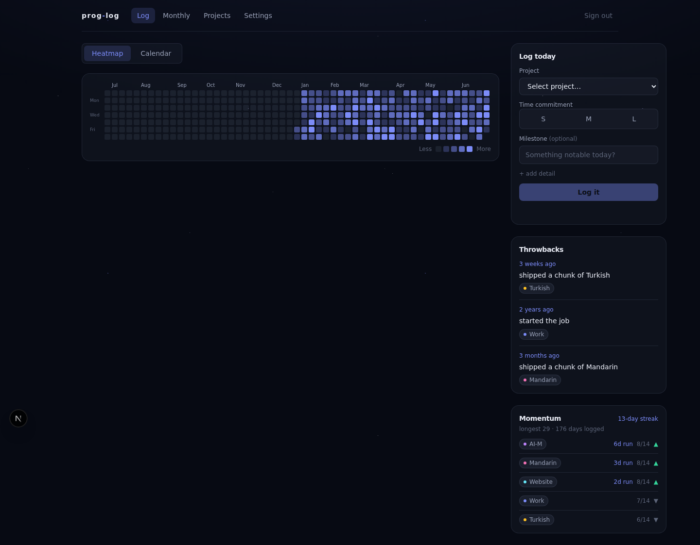

# prog-log

A self-hosted daily work log with an "on this day" anniversary feed. Log what you worked
on in two taps; the log pays you back with a contribution-style heatmap, monthly
breakdowns, streaks — and Throwbacks: past milestones resurfacing on their anniversaries.




## What it does

- **Zero-friction capture.** Pick a Project, tap a Time Commitment (S/M/L), done —
  from the web dashboard, a Discord `/log` slash command, or an iPhone share-sheet
  Shortcut. All three land on one shared write path: one Entry per Project per day,
  re-logging only ever *raises* the day (peak time wins, milestones never erased).
- **Throwbacks.** Milestones you logged months ago resurface on the dashboard and in a
  morning Discord digest — "1 year ago today: shipped v1".
- **A year at a glance.** Custom-SVG heatmap weighted by effort, a month calendar with
  per-project color banners, and a monthly breakdown (stat tiles, time split, stacked
  per-project bars, 90-day effort trend, weekday pattern).
- **Momentum.** Global logging streak plus per-project cadence — rising / steady /
  cooling — so daily practices (languages, habits) keep themselves honest.
- **Yours.** CSV/JSON export and safe re-importable import; a public read-only `/now`
  page for the portfolio; Projects archive by default and can be permanently deleted after archive.

## Stack

Next.js 15 (App Router, TypeScript) · Supabase (Postgres, RLS, magic-link auth) ·
Tailwind · Recharts + custom SVG · Discord Interactions API · Vercel (Hobby) + GitHub
Actions. Runs entirely on free tiers.

## Development

```bash
npm ci
cp .env.example .env.local   # see docs/RUNBOOK.md for every value
npm run dev                  # http://localhost:3000
npm run typecheck && npm run lint && npm run test && npm run build
git config core.hooksPath .githooks   # once per clone: enable the pre-commit gate (lint + typecheck)
```

Tests (unit, component, request, and DB integration against an embedded Postgres) need no
external services. A full local stack is `npx supabase start` (Docker); seed it with demo
history via `psql "$DB_URL" -f scripts/dev-data.sql`.

## Repo tour

| Where | What |
|-------|------|
| `worklog-prd (1).md` | product spec |
| `docs/RUNBOOK.md` | go-live guide: every account, secret, and wiring step |
| `docs/adr/` | architecture decision records (the "why" ledger) |
| `lib/` | data layer: shared write path, rollups, streaks, throwbacks |
| `app/api/` | capture surfaces: Discord, Apple Shortcut, digest cron, export |
| `PRODUCT.md` · `DESIGN.md` | strategic + visual design system agents build to |
